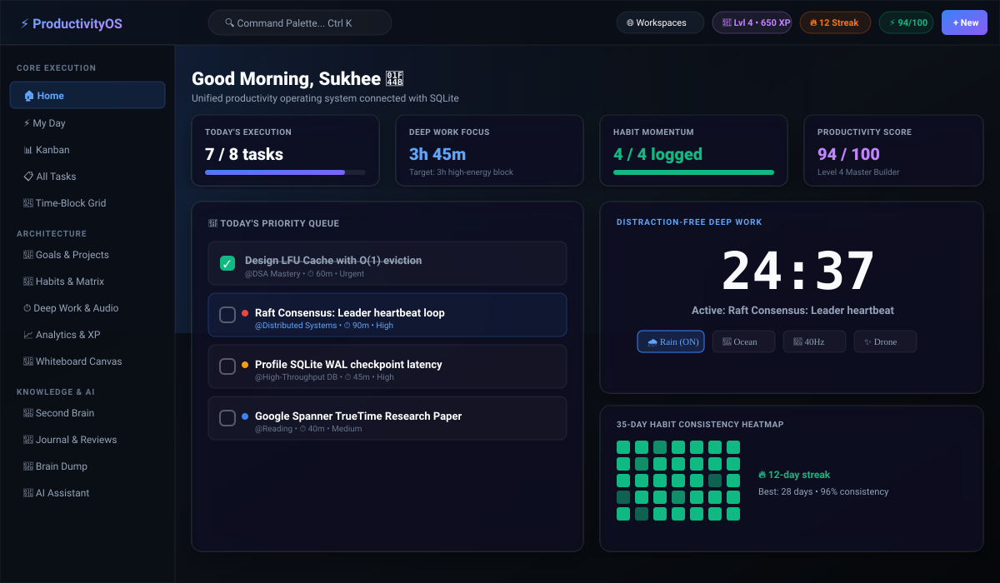

# ⚡ ProductivityOS

> **All-in-One Life & Work Operating System powered by local SQLite.**  
> Unifies Goals, Projects, Tasks, Time-Blocking, Focus Mode, Habits, Analytics, Notes, and AI Scheduling into a single data model.



---

## 🎯 The Core Principle: Single Source of Truth

Traditional productivity workflows force you to duplicate work across separate apps: Todoist, Google Calendar, Trello, Habitica, Pomodoro timers, and Notion.

In **ProductivityOS**, a task created anywhere automatically connects everywhere:

```text
       🎯 BIG GOAL (Vision)
              ↓
        📁 PROJECT (Deadline & Milestones)
              ↓
         📋 TASK (Priority, Estimate, Energy Level)
              ↓
      ┌───────┴───────────────────────┐
      ↓                               ↓
📊 Kanban Pipeline            📅 Time-Block Grid
      ↓                               ↓
⏱ Deep Work Focus            🔁 Linked Habit
      ↓                               ↓
💾 SQLite Time Entries        📈 Real-Time Analytics
      ↓                               ↓
🌙 Evening Reflection         🤖 AI Schedule Optimizer
```

---

## ✨ World-Class Features

### 1. 🎨 Obsidian Glassmorphism UI
- Raycast & Linear-inspired dark aesthetic with custom radial glow.
- Micro-interactions, priority dots, clean status indicators, and frosted glass cards.
- 100% responsive desktop & mobile layout.

### 2. 📅 Interactive Time-Block Calendar
- Hourly slot grid (07:00 – 21:00) for visual day planning.
- Click any open time slot to instantly block out commitments.
- Seamless coexistence of fixed calendar events and flexible tasks.

### 3. 🔁 35-Day Consistency Heatmap
- GitHub-style habit matrix showing color-density completion levels across the past 5 weeks.
- Streak counters, best streak tracking, and target metrics.

### 4. 🎵 Native Procedural Soundscapes
- Built directly with the **Web Audio API** — **zero external audio files or network requests**.
- 4 procedural ambient soundscapes:
  - 🌧 **Filtered Pink Noise Rain**
  - 🌊 **LFO-Modulated Ocean Waves**
  - 🧠 **40Hz Gamma Focus Binaural Beats**
  - ✨ **Deep Space Harmonic Drone**

### 5. 🔍 Global Command Palette (`Ctrl + K`)
- Instant keyboard-first navigation and unified search across **Tasks, Projects, Goals, Habits, and Notes**.
- Keyboard shortcuts cheatsheet accessible via `?`.

### 6. 🎮 Gamification & XP Mastery
- Earn XP dynamically:
  - **+50 XP** per completed task
  - **+2 XP** per focus minute
  - **+20 XP** per logged habit
- Level up through progressive tiers with unlockable achievement badges.

### 7. 🧠 AI Natural Language Brain Dump
- Paste unstructured notes, e.g.:
  > *"Submit physics lab Friday, urgent bugfix for checkout service, buy coffee beans"*
- The engine parses priority, estimates duration, assigns energy levels, and injects tasks directly into SQLite.

### 8. 🌙 Daily Evening Reflection Wizard
- 3-step structured review:
  1. *What was your biggest win today?*
  2. *What caused friction or delay?*
  3. *Top #1 priority for tomorrow.*
- Stores structured diary entries in `journal_entries` and generates instant AI feedback.

### 9. 🌐 Multi-Workspace Scoping
- Dedicated scoping for `Personal`, `College`, and `Work`.
- Switch workspaces via the topbar dropdown to dynamically isolate your dashboard.

---

## 🗄 Backend-Friendly Database Architecture

ProductivityOS runs on **SQLite 3** (`better-sqlite3`), providing a zero-configuration, single-file database optimized for local execution.

```text
┌─────────────────┐       ┌─────────────────┐       ┌─────────────────┐
│     users       │◄──────┤    sessions     │       │   workspaces    │
│ id, username,   │       │ token, expires  │       │ id, name, slug  │
│ password_hash   │       └─────────────────┘       └────────┬────────┘
└────────┬────────┘                                          │
         │                                                   │
         ▼                                                   ▼
┌─────────────────┐       ┌─────────────────┐       ┌─────────────────┐
│      goals      │──────►│    projects     │──────►│      tasks      │
│ id, title, type,│       │ id, title,      │       │ id, title, prio,│
│ target_date     │       │ deadline, color │       │ status, due_date│
└─────────────────┘       └─────────────────┘       └────────┬────────┘
                                                             │
                  ┌──────────────────────────────────────────┼──────────────────────┐
                  ▼                                          ▼                      ▼
         ┌─────────────────┐                        ┌─────────────────┐    ┌─────────────────┐
         │ focus_sessions  │                        │  time_entries   │    │  calendar_events│
         │ task_id, duration│                       │ started, ended  │    │ start, end, all │
         └─────────────────┘                        └─────────────────┘    └─────────────────┘
```

---

## 🚀 Getting Started

### Prerequisites
- Node.js 18+ (tested on Node v20/v22)

### Installation & Run

```bash
# 1. Clone repository
git clone https://github.com/sukhee-2626/productivity-os.git
cd productivity-os

# 2. Install dependencies
npm install

# 3. Start local server
npm start
```

Visit **`http://localhost:4000`** in your browser.

Default admin credentials:
- **Username:** `admin`
- **Password:** `admin123`

---

## 🛠 Available Commands

| Command | Action |
| :--- | :--- |
| `npm start` | Launches HTTP & API web server on port 4000 |
| `npm test` | Runs the 17-point integration test suite |
| `npm run clear` | Wipes database and resets to clean new-user state |
| `npm run cli` | Launches the terminal command-line interface |

---

## 📡 REST API Reference

| Method | Endpoint | Description |
| :--- | :--- | :--- |
| `POST` | `/api/auth/login` | Authenticate user and issue session token |
| `POST` | `/api/auth/register` | Register new user with private workspace |
| `GET` | `/api/overview` | Fetch unified dashboard metrics & daily queue |
| `GET` | `/api/tasks` | List tasks (supports `?workspace_id=` and `?status=`) |
| `POST` | `/api/tasks` | Create task with priority, energy, and estimates |
| `PUT` | `/api/tasks/:id` | Update task & trigger cascade progress updates |
| `DELETE` | `/api/tasks/:id` | Delete single task (one-by-one) |
| `POST` | `/api/tasks/bulk-delete` | Delete selected tasks by ID array (`{ ids: [1, 2] }`) |
| `POST` | `/api/tasks/clear-all` | Delete all tasks in workspace or global |
| `GET` | `/api/kanban` | Fetch Kanban columns (Backlog, Todo, In Progress, Review, Done) |
| `GET` | `/api/habits/heatmap` | 35-day activity matrix for consistency visualization |
| `GET` | `/api/gamification` | Real-time XP, level progress, and badges |
| `POST` | `/api/focus/start` | Start deep work focus session |
| `POST` | `/api/focus/stop` | End focus session and persist time entry |
| `GET` | `/api/search?q=` | Unified search across tasks, projects, goals, notes |
| `POST` | `/api/templates/apply` | 1-click seeding (Software Engineer, Student, Peak Performance) |
| `POST` | `/api/schedule/work` | Generate full 9-to-5 work schedule with engineering tasks |
| `POST` | `/api/schedule/task` | Schedule individual task directly into calendar slot |
| `GET` | `/api/users` | List all registered user accounts |
| `POST` | `/api/users` | Add new user account with personal workspace |
| `DELETE` | `/api/users/:id` | Remove user account |
| `POST` | `/api/daily-review` | Submit evening reflection with AI feedback |
| `GET` | `/api/export` | Download complete JSON snapshot of all SQLite tables |
| `POST` | `/api/workspaces/clear`| Reset all workspace data to clean state |

---

## 🔒 Security & Offline Guarantee
- **Local-first:** All database records and session tokens reside strictly on your machine.
- **Zero Cloud Leakage:** Procedural ambient audio and AI heuristic rules run entirely offline.
- **Node Native Cryptography:** Password hashing uses Node stdlib `crypto.scryptSync` with salt & timing-safe equality checks.

---

## 📄 License
MIT License. Built for peak human performance.
